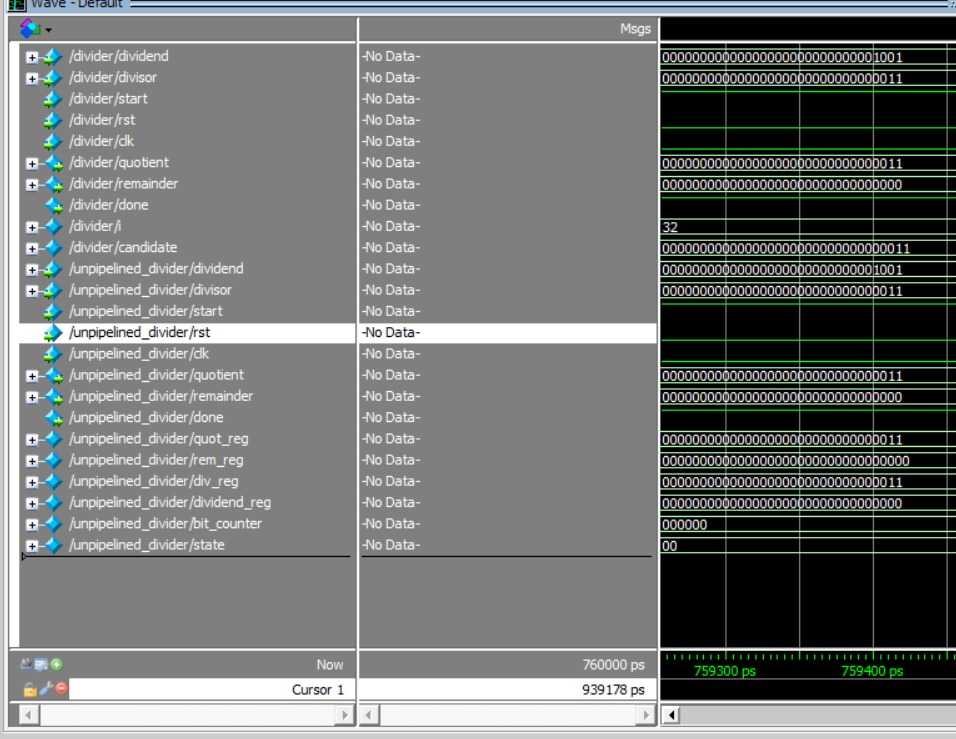
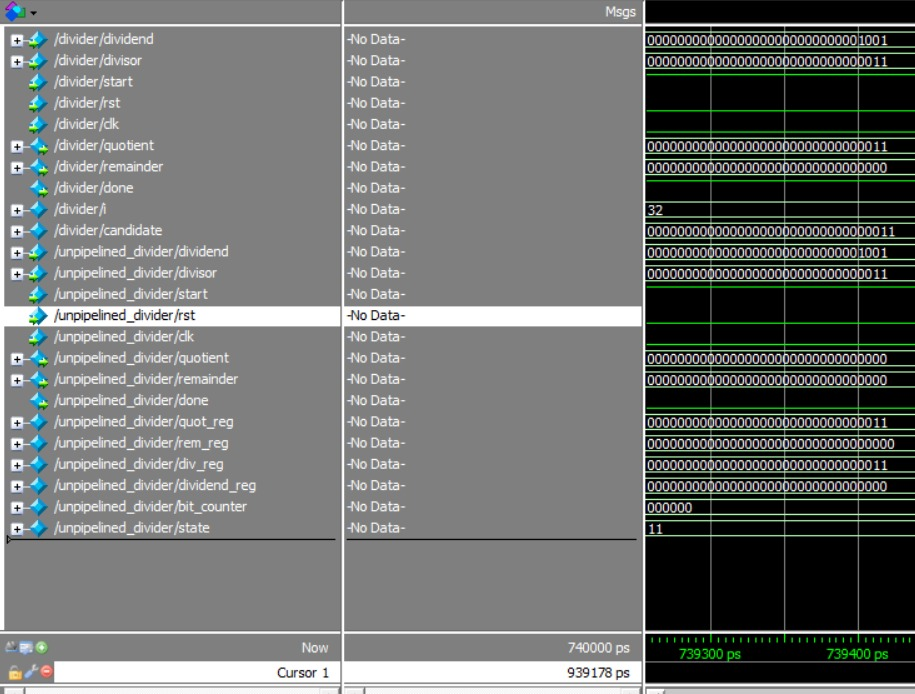

<div align="center">
<h1>DIV_PIPELINE</h1>
</div>

Este repositorio contiene dos implementaciones en Verilog para realizar la división de dos números positivos de `N` bits. El objetivo del proyecto es comparar el rendimiento entre una implementación sin técnicas de *pipelining* y una que sí las incorpora, evaluando la mejora en velocidad proporcionada por el uso de *pipelines*.


---

## Tabla de Contenido

- [1. Descripción General](#1-descripción-general)
- [2. Divider sin Pipeline](#2-divider-sin-pipeline)
  - [2.1 Descripción de Funcionamiento](#21-descripción-de-funcionamiento)
  - [2.2 Análisis Detallado del Código](#22-análisis-detallado-del-código)
- [3. Divider con Pipeline](#3-divider-con-pipeline)
  - [3.1 Arquitectura Pipeline](#31-arquitectura-pipeline)
  - [3.2 Análisis Detallado del Código](#32-análisis-detallado-del-código)
- [4. Comparación de Resultados](#4-comparación-de-resultados)

---

## 1. Descripción General

Ambas implementaciones utilizan el método clásico de división por resta sucesiva con desplazamientos, pero difieren en la estructura de ejecución:

- El divisor **no pipeline** es secuencial y se basa en una máquina de estados finitos (FSM).
- El divisor **con pipeline** está completamente *pipelined*, dividiendo el proceso de división en `N` etapas que operan en paralelo sobre diferentes datos.

---

## 2. Divider sin Pipeline

### 2.1 Descripción de Funcionamiento

Este módulo realiza la división mediante un proceso iterativo basado en una máquina de estados. El algoritmo sigue el método clásico de resta sucesiva con desplazamiento a la izquierda del dividendo. Durante `N` ciclos de reloj, el módulo va evaluando bit a bit si es posible restar el divisor del residuo parcial acumulado, y construye el cociente desplazando los bits a medida que avanza.

El flujo básico es:
- Cargar valores iniciales (dividendo y divisor).
- Evaluar bit por bit.
- Al finalizar, entregar cociente y residuo.

### 2.2 Análisis Detallado del Código

#### Definición de parámetros y puertos
```verilog
parameter N = 32
```
Define el ancho de los operandos (dividendo y divisor), así como del cociente y residuo.

#### Variables internas
```verilog
reg [N-1:0] quot_reg;        // Cociente acumulado
reg [N:0] rem_reg;           // Residuo con un bit adicional para evitar overflow
reg [N-1:0] div_reg;         // Copia del divisor
reg [N-1:0] dividend_reg;    // Copia del dividendo
reg [5:0] bit_counter;       // Contador para las iteraciones
reg [1:0] state;             // Estado actual de la máquina de estados
```

#### Máquina de estados
```verilog
localparam IDLE = 2'b00;
localparam INIT = 2'b01;
localparam CALC = 2'b10;
localparam FINISH = 2'b11;
```

- **IDLE**: Espera el inicio (`start`).
- **INIT**: Carga los operandos y resetea registros.
- **CALC**: Realiza la división bit a bit.
- **FINISH**: Transfiere el resultado a las salidas y vuelve al estado IDLE.

#### Lógica secuencial principal

```verilog
always @(posedge clk or posedge rst) begin
```
Manejo del flanco positivo del reloj y reinicio asincrónico.

##### Estado INIT
```verilog
quot_reg <= 0;
rem_reg <= 0;
div_reg <= divisor;
dividend_reg <= dividend;
bit_counter <= N;
state <= CALC;
```
Inicializa los registros antes de comenzar la operación.

##### Estado CALC
```verilog
if (bit_counter > 0) begin
    rem_reg <= {rem_reg[N-1:0], dividend_reg[N-1]};
    dividend_reg <= {dividend_reg[N-2:0], 1'b0};
```
Desplaza el dividendo y actualiza el residuo.

```verilog
if ({rem_reg[N-1:0], dividend_reg[N-1]} >= {1'b0, div_reg}) begin
    rem_reg <= {rem_reg[N-1:0], dividend_reg[N-1]} - {1'b0, div_reg};
    quot_reg <= {quot_reg[N-2:0], 1'b1};
end else begin
    quot_reg <= {quot_reg[N-2:0], 1'b0};
end
```
Verifica si se puede restar el divisor del residuo actual:
- Si es posible, actualiza el residuo restando el divisor y añade 1 al cociente.
- Si no, simplemente añade un 0 al cociente.

```verilog
bit_counter <= bit_counter - 1;
```
Reduce el contador para pasar al siguiente bit.

##### Estado FINISH
```verilog
quotient <= quot_reg;
remainder <= rem_reg[N-1:0];
done <= 1;
state <= IDLE;
```
Entrega el resultado final y vuelve a esperar un nuevo inicio.

---

## 3. Divider con Pipeline

### 3.1 Arquitectura Pipeline

Este módulo implementa la división mediante una arquitectura de pipeline de `N` etapas, donde cada etapa procesa un bit del dividendo y actualiza los valores parciales del cociente y residuo. Cada etapa trabaja de manera independiente y en paralelo con las demás, lo que permite una alta tasa de procesamiento una vez que el pipeline se ha llenado.

### 3.2 Análisis Detallado del Código

#### Definición de parámetros y puertos
```verilog
parameter N = 32;
```
Define el número de bits para los operandos de entrada y salida.

#### Declaración de registros internos
```verilog
reg [N:0] remainder_reg [0:N];     // Registros para los residuos en cada etapa
reg [N-1:0] divisor_reg [0:N];     // Registros del divisor en cada etapa
reg [N-1:0] quotient_reg [0:N];    // Registros del cociente parcial
reg [N-1:0] dividend_reg [0:N];    // Registro del dividendo con desplazamiento
reg ready_flag [0:N];              // Bandera que indica si los datos están listos
```
Estos vectores de registros modelan un pipeline profundo con `N` etapas.

#### Registro del candidato a residuo
```verilog
reg [N:0] candidate;
```
Contiene el valor temporal para decidir si se puede restar el divisor del residuo parcial en una etapa determinada.

#### Lógica secuencial principal
```verilog
always @(posedge clk, posedge rst) begin
```
El bloque siempre responde al flanco de subida del reloj o al reset asincrónico.

##### Fase de reinicio
```verilog
if (rst) begin
    for (i = 0; i <= N; i = i + 1) begin
        remainder_reg[i] <= 0;
        divisor_reg[i] <= 0;
        quotient_reg[i] <= 0;
        ready_flag[i] <= 0;
        dividend_reg[i] <= 0;
    end
    done <= 0;
```
Inicializa todos los registros del pipeline a cero.

##### Fase de propagación y cálculo por etapas
```verilog
remainder_reg[0] <= 0;
divisor_reg[0] <= divisor;
quotient_reg[0] <= 0;
ready_flag[0] <= start;
dividend_reg[0] <= dividend;
```
Se cargan los datos de entrada en la etapa inicial del pipeline.

```verilog
for (i = 0; i < N; i = i + 1) begin
    if (ready_flag[i]) begin
        candidate = {remainder_reg[i][N-1:0], dividend_reg[i][N-1]};
        dividend_reg[i+1] <= dividend_reg[i] << 1;
```
Calcula el nuevo residuo parcial combinando el residuo anterior con el siguiente bit del dividendo.

```verilog
if (candidate < {1'b0, divisor_reg[i]}) begin
    quotient_reg[i+1] <= (quotient_reg[i] << 1);
    remainder_reg[i+1] <= candidate;
end else begin
    quotient_reg[i+1] <= (quotient_reg[i] << 1) | 1'b1;
    remainder_reg[i+1] <= candidate - {1'b0, divisor_reg[i]};
end
```
Actualiza el cociente y el residuo dependiendo del resultado de la comparación con el divisor.

```verilog
divisor_reg[i+1] <= divisor_reg[i];
ready_flag[i+1] <= ready_flag[i];
```
Propaga los valores al siguiente nivel del pipeline.

##### Finalización del pipeline
```verilog
if (ready_flag[N]) begin
    quotient <= quotient_reg[N];
    remainder <= remainder_reg[N][N-1:0];
    done <= 1;
end else begin
    done <= 0;
end
```
Cuando los datos llegan a la etapa final, se asignan los resultados a las salidas.

---

## 4. Comparación de Resultados

La simulación de ambos códigos se realizó en ModelSIM, para este ejemplo, el dividendo es `9` y el divisor es `3`, por lo que se espera que el cociente de la división sea `3` y el residuo `0`. La implementación con pipelines resultó ser más eficiente como se puede apreciar en las figuras de abajo. 

<p align="center">
  
  
</p>

La figura de la izquierda muestra el tiempo que toma en realizar la división `9/3` sin el uso de pipelines, en este caso, tal tiempo fue de 0.759 µs aproximadamente. Se puede ver claramente que tanto la variable *quotient* del código `divider` como la del código `unpipelined_divider` tiene un valor de 2'b11, que corresponde al número 3 en decimal.\
Por otro lado, la figura de la derecha señala que el tiempo en el que la división se realiza con el uso de los pipelines es de 0.739 µs. Además, la variable *quotient* del código `unpipelined_divider` se mantiene en cero, pues aún no ha transcurrido el tiempo suficiente para que se realice la división.

Los resultados de la simulación muestran claramente las ventajas del uso de pipelines en sistemas digitales. Aunque ambos diseños generan el resultado correcto (`quotient = 3`, `remainder = 0`) para la operación `9 ÷ 3`, el diseño con pipelines lo hace en menos tiempo: aproximadamente 0.739 µs frente a los 0.759 µs del diseño secuencial. Esta mejora, aunque leve en este caso simple, se amplifica significativamente en aplicaciones donde múltiples divisiones se ejecutan en serie, permitiendo una mayor tasa de procesamiento (throughput) gracias a la arquitectura en etapas.

---

## Autores

Trabajo realizado para la asignatura de **Diseño de Sistemas Digitales**.\
Autores: Jerónimo Quintero, Samuel Arango, Ivan Pérez\
Docente: Diego Alejando Franco Alvarez

